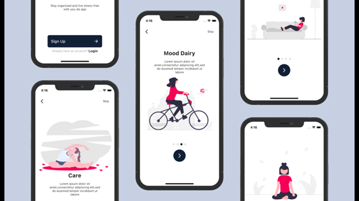

# 🍔Introducing the ultimate Mobile UI Kits collection! 

Our repository offers a vast range of stunning and professionally designed UI Kits, catered to help you create visually appealing and functionally efficient mobile apps.

We understand how important it is for you to create an impactful app that stands out in the crowded market, and that's why we have carefully crafted our UI Kits with an eye for detail and user experience. Our repository has everything from vibrant color schemes, eye-catching typography, intuitive navigation, and engaging animations, all intended to enhance your app's usability and drive user engagement.

But that's not all - we aim to provide more than just a product. Our UI Kits are designed to inspire and motivate, sparking creativity and helping you bring your app to life. We take pride in our work, and we're confident that you'll love our UI Kits as much as we do.

So, what are you waiting for? Subscribe to our channel now and unlock the potential to create truly stunning mobile apps. With our UI Kits, the possibilities are endless. Like our Github repository and get ready to take your app to the next level!

Star ⭐ the repo if you like and Follow 😉.

## 📸 ScreenShots

     
<!-- | 1 | 2|
|------|-------|
||| -->

## ✨ Requirements
* Any Operating System (ie. MacOS X, Linux, Windows)
* Any IDE with Flutter SDK installed (ie. IntelliJ, Android Studio, VSCode etc)
* A little knowledge of Dart and Flutter
* A brain to think 🤓🤓

## 🤓 Author(s)
**Bakht Muhammad** 

[)](https://www.youtube.com/@bakht.muhammad)

[)](mailto:engbakhtmuhammad@gmail.com)

